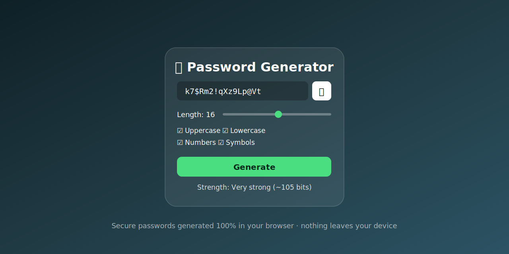

# 🔐 Password Generator

A fast, secure **password generator** that runs entirely in your browser. Uses the browser's cryptographic random generator — nothing is sent anywhere.

🔗 **[Try it live](https://aashishbharti04.github.io/password-generator/)**

## ✨ Features
- Adjustable length (4–64 characters)
- Toggle uppercase, lowercase, numbers, and symbols
- One-click copy to clipboard
- Cryptographically secure randomness (`crypto.getRandomValues`)
- 100% offline — a single set of static files

## 🚀 Usage
Open `index.html` in any browser, or use the hosted version on GitHub Pages.

## 🤝 Contributing
Contributions are welcome — open an issue or send a pull request.

## 📄 License
Released under the MIT License — see [LICENSE](LICENSE).
